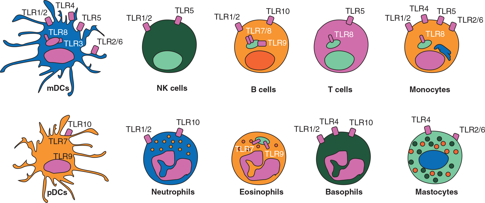
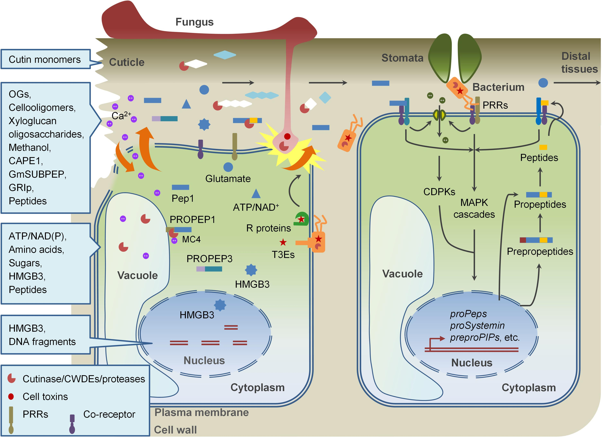
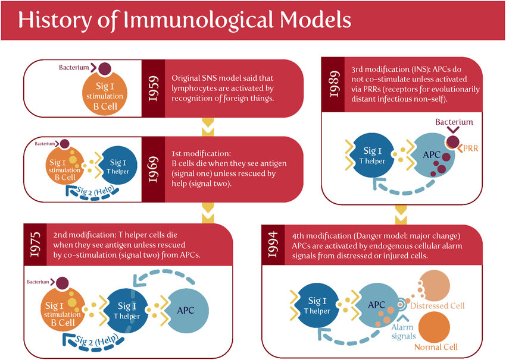

# Global Immunological Course -Day-2

### Session 2: Prof. Carla Rothlin, Yale School of Medicine

### Innate Immunity:

#### Structure Based Recognition
- **Case: DNA - Pattern-Based Recognition:**
  - DNA is generally in the nucleus.
  - Foreign DNA in the cytoplasm activates CGAS (Cyclic GMP AMP Synthase), which recognizes foreign DNA, produces c-GAMP (messenger), activates STING, and eliminates the foreign DNA.

- **Case: RNA:**
  - Strategies:
    - Phagolysome (receptors activated at acidic pH):
      - TLR-3 (dsRNA), TLR-7 (ssRNA), TLR-9 (DNA).
    - RNA from virus into cytoplasm:
      - Sensors like RIR-I and MDA-5.
      - Human messenger RNA (mRNA) has a cap, distinguishing it from foreign RNA.
      - MDA-5 can recognize double-stranded RNA.

- **Sensors: NOD I/II:**
  - Recognize peptidoglycan.

*Pattern Recognition Receptors of various cells source: https://doi.org/10.1093/annonc/mdx179*

  <!-- _posts\media\pattern_recognition_receptors_of_cells.jpg -->
  <!--  -->

#### Recognition of Damage
- **Inflammasomes:**
  - NLRP3 sensor detects damage, leading to assembly with ASC (an adaptor) and CASPASE-1 (enzyme).
  - CASPASE-1 cleaves pro-IL-1, inducing inflammation.
  - Mechanism of pro-IL-1 release needs clarification.

- **Signaling Cascades:**
  - TLR-4 uses MyD88 adaptor → TAKI enzyme → IKK → NF(kappa)(beta) induction of inflammatory mediators.
  - Dendritic Cells (Mature) → T-cells (activation).
  - Inflammatory Response → Cytokines and chemokines.

  
  *Damage associated molecular patterns source: https://doi.org/10.3389/fpls.2019.00646*

### Cytokines
- Type I Interferons:
  - Discovered 70 years ago for interfering with viral infections.
  - Induce antiviral genes via JAK-STAT pathways.
  - Prevent viral replication machinery but not recommended for neurons, heart cells, or germ cells.

# Group Discussion: mRNA Vaccine & Nobel Prize in Medicine 2023
- Exploring mRNA functionality, vaccine mechanisms, and addressing challenges.

### Session 3: Dr. Dipyaman Ganguly, IISER
#### Me or not Me: Towards a Standard Model for Cellular Immunology

- Standard model evolution: Self vs. non-self, central tolerance, exceptions.
- Evolutionary necessity of an immune system: Understanding self and not self.
- Various models' limitations: self-nonself, immune system reactions to infectious entities, exceptions in graft rejections, and pregnancy.

#### Danger Model: Poly Matzoinger
- Focuses on harm-causing entities regardless of origin but lacks explanation for NK cell behavior.

*History of Immune Models source: Matzinger’s “danger model” vs. the classical theory of self vs. self-nonself*

#### Antigenic Discontinuity Theory by Thosma Pradeu and Eruc Viver (2013)
- Suggests NK cell reaction to cellular changes.

### Evolution
- Evolution's role in the emergence of multicellular organisms and the necessity of an immune system to counter defectors.
- Multicellular organismality and ethical aspects.

### Cancer Immunity Cycle
- Highlights the deviation in cancer cells from standard cellular functionalities.

### Metaflammation & Alzheimer's
- Links between cellular dysfunctions and related health issues.

### Autoimmunity
- Conflicts and cues leading to autoimmunity.

# Talk-4: Dr. Vinitha

## How to Read Research Papers

### What is Science?
- A system of acquiring knowledge and its accumulation.
- Everyday science: mundane tasks to complex research.

### What is Technology?
- Systematic treatment of art and its practical application.

#### Paper: Vaccine Treatment of Splenomegaly in Chronic Malaria by BE Ingram Johnson LRCP Ed (15th Aug 1925)
- First report on malaria vaccine.
- Critique on methodological apparatus: lack of control, missing references, and interpretations.

- Consideration of premunition (balanced immunity) and the Hayflick limit in analyzing the results.
- WHO approval of the malaria vaccine in 2021.

*Research, report findings, and publish!*
